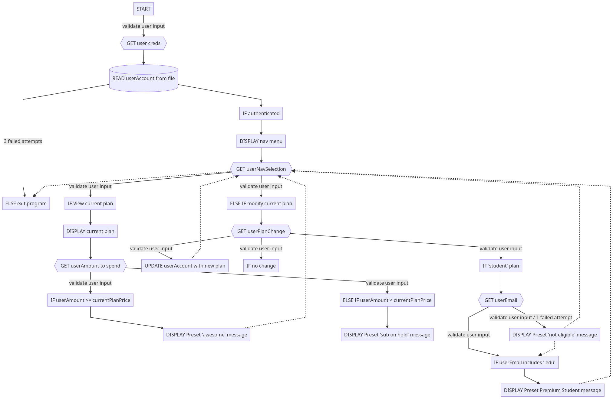

# Spotify Lab Assignment

Used [this tutorial](https://andrew-flower.com/blog/Spring-Boot-and-React-1) to
set up Java backend tooling with JavaScript frontend

________

## Resources Used

### Java Objects
- [Java Programming Tutorial - 04 - Defining a Class and Creating Objects in
  Java](https://www.youtube.com/watch?v=4xKihjI6HJ0)
- [Java Programming Tutorial - 05 - Storing and Accessing Instance Variables of
  an Object](https://www.youtube.com/watch?v=q4vknQYjHy8)

### Strings
- [Java String split() Method with examples](https://beginnersbook.com/2013/12/java-string-split-method-example/)
-
[StackOverflow: Splitting an array of strings in Java using .split](https://stackoverflow.com/questions/19431710/splitting-an-array-of-strings-in-java-using-split)
________

## Pseudocode

Written in [Mermaid.js syntax](https://mermaid-js.github.io/mermaid/) which outputs the following/attached flowchart.


```
graph TD
    A[START] -->|validate user input| B{{GET user creds}}
    B --> C[(READ userAccount from file)]
    C --> D[IF authenticated]
    C --> |3 failed attempts| X[ELSE exit program]
    D --> E[DISPLAY nav menu]
    E --> F{{GET userNavSelection}}
    F --> |validate user input| G[IF View current plan]
    F --> |validate user input| H[ELSE IF modify current plan]
    F -.-> X
    G --> I[DISPLAY current plan]
    I --> J{{GET userAmount to spend}}
    J --> |validate user input| K[IF userAmount >= currentPlanPrice]
    K --> L[DISPLAY Preset 'awesome' message]
    L -.-> F
    J --> |validate user input| M[ELSE IF userAmount < currentPlanPrice]
    M --> N[DISPLAY Preset 'sub on hold' message]
    H --> O{{GET userPlanChange}}
        O --> |validate user input| R[UPDATE userAccount with new plan]
    R -.-> F
    O --> |validate user input| P[IF no change]
    O --> |validate user input| Q[IF 'student' plan]
    Q --> T{{GET userEmail}}
    T --> |validate user input| U[IF userEmail includes '.edu']
    U --> V[DISPLAY Preset Premium Student message]
    T --> |validate user input / 1 failed attempt| W[DISPLAY Preset 'not eligible' message]
    V -.-> F
    W -.-> U
    W -.-> F
    ```
    
  
    
    
    
  ###  Mermaid Config
```
{
  "theme": "default"
}
```
